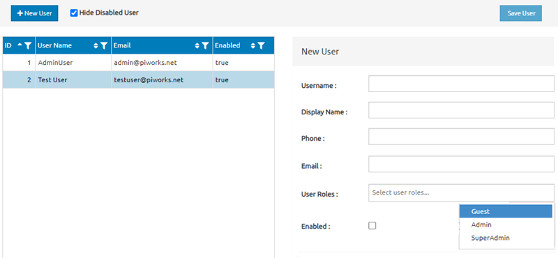

# User Management Screen UI Specification

## Overview
This document outlines the functional requirements, UI components, and behavior for the User Management screen, as seen in the provided image.

This screen is designed to manage users by adding, updating, and viewing user information. The UI includes a user table for listing existing users and a form for adding new users or editing existing users.

---

## 1. Requirements

- **Add New Users**: The interface should allow the admin to add new users with details such as username, display name, phone, email, roles, and enable/disable status.
- **View Existing Users**: Users can view a list of existing users with their usernames, emails, and status.
- **Edit Users**: Users from the list can be selected to edit their details on the form.
- **Enable/Disable Users**: Users can be marked as enabled or disabled.
- **Hide Disabled Users**: There should be a toggle to hide or show disabled users.

---

## 2. Initial View

When the page first loads:
- The user list on the left side is displayed with columns for ID, username, email, and enabled status.
- The form on the right side is blank, ready for input.
- A checkbox labeled **"Hide Disabled User"** is checked by default to hide disabled users from the list.
- A button labeled **“+ New User”** is visible for adding a new user.
- The **"Save User"** button at the top right of the form is disabled until valid data is inputted.

---

## 3. UI Components

### 3.1 User List Table

#### Columns:
- **ID**: Unique user identifier (auto-incremented).
- **User Name**: The username of the user.
- **Email**: The email address of the user.
- **Enabled**: Boolean (true/false), indicating whether the user is enabled or not.

#### Behavior:
- The list should be sorted by default by **ID** (ascending).
- Each column should be sortable when clicked.
- When **"Hide Disabled User"** is checked, users with `Enabled=false` should be filtered out.
- Selecting a user row should populate the form on the right for editing that user’s information.

---

### 3.2 User Form (Add/Edit)

#### Fields:
- **Username**: (Required) Input field for the username. This field should be unique.
- **Display Name**: (Optional) Input field for the display name.
- **Phone**: (Optional) Input field for the phone number.
- **Email**: (Required) Input field for the user's email. Must follow email validation rules.
- **User Roles**: Dropdown list with options:
  - **Guest**
  - **Admin**
  - **SuperAdmin**
  
  Multiple roles can be selected for each user.
  
- **Enabled**: Checkbox to mark the user as enabled or disabled.

#### Behavior:
- The **Save User** button should remain disabled until all required fields (Username and Email) are filled.
- When a user row from the list is selected, the form should populate with that user’s information for editing.
- The **Enabled** checkbox should reflect the user’s current enabled status.
- Clicking the **Save User** button will save the new or updated information and refresh the user list.

---

### 3.3 Buttons and Interactions

#### **+ New User Button**:
- Clicking this button should clear the form on the right and prepare it for adding a new user.
- The **Save User** button should become enabled once the form fields are properly filled.

#### **Save User Button**:
- This button is enabled only when the required fields (Username, Email) have valid entries.
- When clicked, it will save the new or updated user information and refresh the user list on the left.

#### **Hide Disabled User Checkbox**:
- When checked, only users with `Enabled=true` should be displayed in the user list.
- When unchecked, all users (enabled and disabled) are displayed.

---

## 4. Error Handling

- If a required field (Username, Email) is left blank or incorrectly filled, an error message should be shown under the corresponding field.
- Duplicate usernames should trigger an error message.
- Email validation should ensure proper format (`example@domain.com`).
- Phone number should be validated if a specific format is required.

---

This specification serves as a comprehensive guide for developing the User Management screen. Following these guidelines will ensure a user-friendly interface and effective user management.
